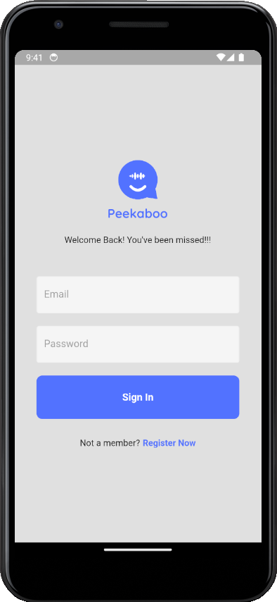
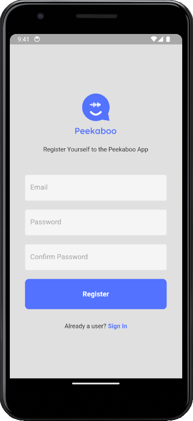
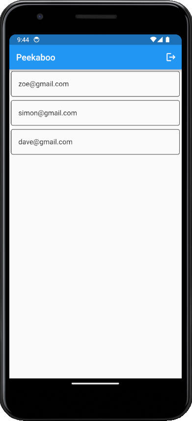
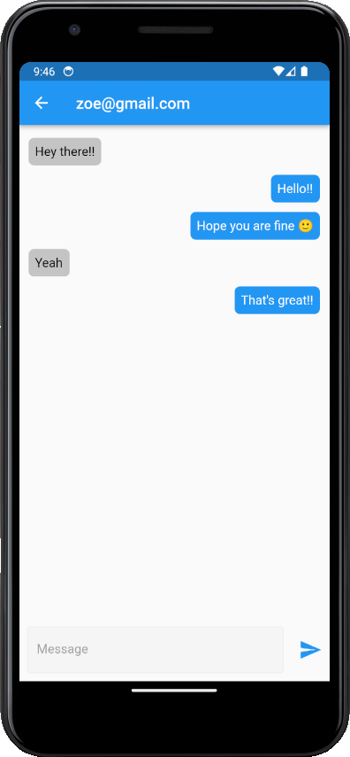

# Peekaboo

A Flutter and Firebase based chat application.

Peekaboo is created keeping in mind simplicity and ambiguity which one may desire in the world of hyper-able chat applications, with the ease and minimality of usage. This is the perfect application one may want to convey free text messages over an internet connection.

## Screenshots

	

		
		
SignIn

	

	

		
		
Register

	

	

		
		
Home Page

	

	

		
		
Chat Facility

	

## Technologies Used

- Flutter - Frontend of the Application
- FireBase - Database Storage and Function
  - FireStore - Storing user and chat data
  - Firebase Functions for SignIn, Register, LogOut
